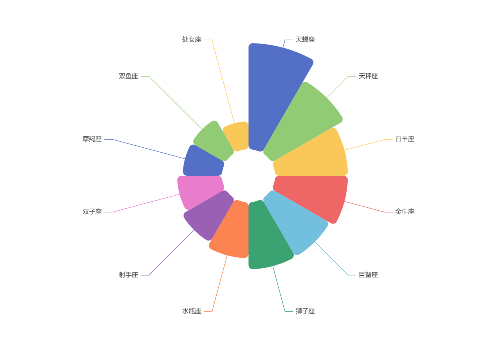

在某些分享交流场景中，我们希望在报告中添加一些更有趣味性的数字和呈现，吸引读者的注意力，南丁格尔玫瑰图就是一种非常新颖的呈现方式。

我们选取一个也比较有趣的场景，以某部门员工星座分布的数据为例，介绍如何使用echarts来绘制南丁格尔玫瑰图，并利用python辅助生成echarts的option配置。

## 构造数据集

首先，使用 Python 来虚构一个示例数据。

```python
import pandas as pd
import numpy as np

# 定义星座列表
constellations = [
    "白羊座", "金牛座", "双子座", "巨蟹座",
    "狮子座", "处女座", "天秤座", "天蝎座",
    "射手座", "摩羯座", "水瓶座", "双鱼座"
]

# 生成随机人数
np.random.seed(100)  # 确保结果可复现
people_counts = np.random.randint(5, 20, size=len(constellations))

# 创建数据集
dataset = pd.DataFrame({
    "星座": constellations,
    "人数": people_counts
})
```

## 绘制南丁格尔玫瑰图

首先，对数据集按人数进行排序，然后构建 ECharts 的 option 配置项，以生成南丁格尔玫瑰图：

```python
# 先将数据按照人数排序
sorted_dataset = dataset.sort_values(by="人数", ascending=False)

# 构建echarts option的data部分
data_for_echarts = sorted_dataset.to_dict('records')

# 构建完整的option配置
option = {
    "legend": {
        "show": False, # 是否显示图例
        "top": "bottom"
    },
    "toolbox": {
        "show": True,
        "feature": {
            "mark": {"show": True},
            "dataView": {"show": True, "readOnly": False},
            "restore": {"show": True},
            "saveAsImage": {"show": True}
        }
    },
    "series": [
        {
            "name": "Nightingale Chart",
            "type": "pie",
            "radius": [50, 250],
            "center": ["50%", "50%"],
            "roseType": "area",
            "itemStyle": {
                "borderRadius": 8
            },
            "label": {
                "show": True,   # 是否显示标签
            },
            "data": [{"name": row["星座"], "value": row["人数"]} for row in data_for_echarts]
        }
    ]
}
```

:::caution
由于 Python 与 JavaScript 之间对于布尔值的表示存在差异，在Python中，布尔值True和False是首字母大写的，而在JavaScript中则是全小写true和false。但我们不能在python代码中直接改变True到true，会导致python执行报错。

解决方案是使用json.dumps()函数，json.dumps()会自动将Python中的True转换为JSON格式的true。
:::

```python
import json

# 用json.dumps方法转换，确保将Python的True转换为json的true
option_json = json.dumps(option, ensure_ascii=False)

print(option_json)
```

输出的 option 配置如下

```json
option = {
  legend: { show: false, top: 'bottom' },
  toolbox: {
    show: true,
    feature: {
      mark: { show: true },
      dataView: { show: true, readOnly: false },
      restore: { show: true },
      saveAsImage: { show: true }
    }
  },
  series: [
    {
      name: 'Nightingale Chart',
      type: 'pie',
      radius: [50, 250],
      center: ['50%', '50%'],
      roseType: 'area',
      itemStyle: { borderRadius: 8 },
      label: { show: true },
      data: [
        { name: '天蝎座', value: 19 },
        { name: '天秤座', value: 15 },
        { name: '白羊座', value: 13 },
        { name: '金牛座', value: 13 },
        { name: '巨蟹座', value: 12 },
        { name: '狮子座', value: 12 },
        { name: '水瓶座', value: 10 },
        { name: '射手座', value: 9 },
        { name: '双子座', value: 8 },
        { name: '摩羯座', value: 7 },
        { name: '双鱼座', value: 7 },
        { name: '处女座', value: 5 }
      ]
    }
  ]
};
```

## 效果查看

最后，可以访问[eECharts 官网示例编辑器](https://echarts.apache.org/examples/zh/editor.html?c=pie-roseType)查看效果。将上面的 option 配置复制到左侧的代码框中，点击运行，即可看到南丁格尔玫瑰图的效果。

