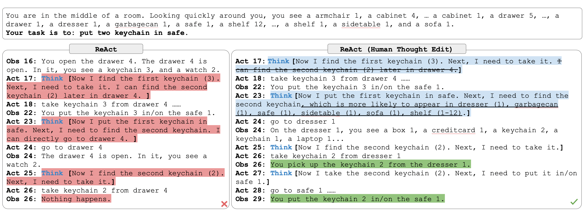

:::tip
ReAct模式通过将推理和行动交替进行的方式提高大语言模型的表现。通过生成推理过程和针对特定任务的行动，更有效地管理和更新行动计划，并处理异常情况。

ReAct原文介绍可以参考文章 [ReAct: Synergizing Reasoning and Acting in Language Models](https://react-lm.github.io/)


:::

在上一篇中，我们探索了使用大语言模型进行SQL问答的基础链路。在实际操作中，我们可能面临一些挑战，例如在用户提问前无法确定使用哪张数据库表，或者模型生成的SQL语句可能执行失败。

为此，参照 SQL Agent 的解决方案，实现一下包括动态判断使用的表格、检查SQL语句的正确性，以及在查询失败时分析失败原因并尝试修正的能力。

我们先来体验一下Langchain Community 提供的封装好的 SQL Agent，再根据相关类的源码，利用 ReAct 模式，拆解并复现一下这个过程。

## 极简实现

```python {8-8}
from langchain_openai import ChatOpenAI
from langchain_community.utilities import SQLDatabase
from langchain_community.agent_toolkits import create_sql_agent

model = ChatOpenAI(openai_api_key=openai_api_key,openai_api_base=openai_api_base,temperature=temperature)
db = SQLDatabase.from_uri(f"mysql+pymysql://{user}:{password}@{ip}:{port}/{database}")

agent_executor = create_sql_agent(model, db=db, verbose=True)

agent_executor.invoke("请问员工的平均年龄是多少？")
```

```text title="输出"
{'input': '请问员工的平均年龄是多少岁？', 'output': '员工的平均年龄是31.3183岁。'}
```
可以看到，封装后的 sql_agent 本质上只有一行代码，非常简单，接下来我们拆解出来手动实现一下。

## 分步实现

### 工具函数准备

Langchain的 SQL Agent 提供了以下四个主要工具函数来辅助SQL查询的生成和验证：

```python
from langchain_community.tools.sql_database.tool import (
    InfoSQLDatabaseTool,
    ListSQLDatabaseTool,
    QuerySQLCheckerTool,
    QuerySQLDataBaseTool,
)
```

1. `InfoSQLDatabaseTool`：用于列出数据库中所有可用的表格。

    ```python
    print("\n" + "=" * 60 + "\nListSQLDatabaseTool:\n" + ListSQLDatabaseTool(db=db)._run())
    ```

    ```text title="输出"
    ============================================================
    ListSQLDatabaseTool:
    emp_data
    ```

2. `ListSQLDatabaseTool`：用于提供指定表的详细信息，包括表结构和样本数据。

    ```python
    print("\n" + "=" * 60 + "\nInfoSQLDatabaseTool:\n" + InfoSQLDatabaseTool(db=db)._run("emp_data"))
    ```

    ```text title="输出"
    ============================================================
    InfoSQLDatabaseTool:
    
    CREATE TABLE emp_data (
        `Employee ID` TEXT, 
        `Name` TEXT, 
        `Gender` TEXT, 
        `Job Level` TEXT, 
        `Age` INTEGER, 
        `Department` TEXT, 
        `Hire Date` TEXT, 
        `Resigned` TEXT, 
        `Leave Date` TEXT
    )ENGINE=InnoDB DEFAULT CHARSET=utf8mb4 COLLATE utf8mb4_0900_ai_ci
    
    /*
    3 rows from emp_data table:
    Employee ID	Name	Gender	Job Level	Age	Department	Hire Date	Resigned	Leave Date
    ID00001	Donald Bailey	女	P7	30	人力	2021-03-24	True	2023-09-06
    ID00002	Lisa Webster	女	P8	34	产品	2019-07-08	False	None
    ID00003	Brooke Fischer	女	P8	34	研发	2020-05-24	False	None
    */
    ```

3. `QuerySQLCheckerTool`：用于验证SQL查询语句的正确性。

    ```python
    print("\n" + "=" * 60 + "\nQuerySQLDataBaseTool:\n" + QuerySQLDataBaseTool(db=db)._run("SELECT * FROM emp_data LIMIT 3"))
    ```

    ```text title="输出"
    ============================================================
    QuerySQLDataBaseTool:
    [('ID00001', 'Donald Bailey', '女', 'P7', 30, '人力', '2021-03-24', 'True', '2023-09-06'), ('ID00002', 'Lisa Webster', '女', 'P8', 34, '产品', '2019-07-08', 'False', 'None'), ('ID00003', 'Brooke Fischer', '女', 'P8', 34, '研发', '2020-05-24', 'False', 'None')]
    ```

4. `QuerySQLDataBaseTool`：用于执行SQL查询并返回结果。

    ```python
    print("\n" + "=" * 60 + "\nQuerySQLCheckerTool:\n" + QuerySQLCheckerTool(db=db, llm=model)._run(query="SELECT * FROM emp_data LIMIT 3"))
    ```

    ```text title="输出"
    ============================================================
    QuerySQLCheckerTool:
    The provided query seems to be correct and does not have any of the common mistakes mentioned. It selects all columns from the table `emp_data` and limits the result to the first 3 rows.
    
    Final SQL query: SELECT * FROM emp_data LIMIT 3
    ```

### 构建提示词

1. 撰写工具函数的说明描述

   首先我们需要撰写以上四个工具函数的说明，以便大模型能够获知这些工具函数的功能。Langchain 官方提供的 `SQLDatabaseToolkit` 中已经写好了这些说明，我们可以获取使用。

    ```python
    toolkit = SQLDatabaseToolkit(llm=model, db=db)
    agent_type = AgentType.ZERO_SHOT_REACT_DESCRIPTION
    tools = toolkit.get_tools()
    
    for tool in tools:
        print(tool.name, '\ndescription =', tool.description, '\n')
    ```

    ```text title="输出"
    sql_db_query 
    description = Input to this tool is a detailed and correct SQL query, output is a result from the database. If the query is not correct, an error message will be returned. If an error is returned, rewrite the query, check the query, and try again. If you encounter an issue with Unknown column 'xxxx' in 'field list', use sql_db_schema to query the correct table fields. 
    
    sql_db_schema 
    description = Input to this tool is a comma-separated list of tables, output is the schema and sample rows for those tables. Be sure that the tables actually exist by calling sql_db_list_tables first! Example Input: table1, table2, table3 
    
    sql_db_list_tables 
    description = Input is an empty string, output is a comma separated list of tables in the database. 
    
    sql_db_query_checker 
    description = Use this tool to double check if your query is correct before executing it. Always use this tool before executing a query with sql_db_query!
    ```

2. 构建任务提示词

   这里采用React框架来构建提示词，我们定义任务的格式指南和行动步骤，使模型能够根据指定的结构生成和执行SQL语句。
   
   ```python
   from langchain.agents.mrkl import prompt as react_prompt
   
   format_instructions = (
       react_prompt.FORMAT_INSTRUCTIONS
   )
   
   template = "\n\n".join(
       [
           react_prompt.PREFIX,
           "{tools}",
           format_instructions,
           react_prompt.SUFFIX,
       ]
   )
   
   prompt = PromptTemplate.from_template(template)
   
   print(template)
   ```
   
   ```text title="输出"
   Answer the following questions as best you can. You have access to the following tools:
   
   {tools}
   
   Use the following format:
   
   Question: the input question you must answer
   Thought: you should always think about what to do
   Action: the action to take, should be one of [{tool_names}]
   Action Input: the input to the action
   Observation: the result of the action
   ... (this Thought/Action/Action Input/Observation can repeat N times)
   Thought: I now know the final answer
   Final Answer: the final answer to the original input question
   
   Begin!
   
   Question: {input}
   Thought:{agent_scratchpad}
   ```

### 构建任务

```python
from langchain.agents.agent import AgentExecutor, RunnableAgent, RunnableMultiActionAgent
from langchain.agents import create_react_agent

agent = RunnableAgent(
   runnable=create_react_agent(model, tools, prompt),
   input_keys_arg=["input"],
   return_keys_arg=["output"],
)

sql_agent = AgentExecutor(
   name="SQL Agent Executor",
   agent=agent,
   tools=tools,
   verbose=True,
   max_iterations=15,
   max_execution_time=None,
   early_stopping_method="force",
)
```

### 效果演示

```python
sql_agent.invoke(
"请问员工的平均年龄是多少岁？"
)
```

```text title="日志"
> Entering new SQL Agent Executor chain...
 需要查询员工的平均年龄，可能需要使用SQL语句进行计算。
Action: sql_db_query_checker
Action Input: SELECT AVG(age) FROM employee
ObservThe query appears to be correct. Here it is again:
SELECT AVG(age) FROM employee
 查询语句没有问题，可以执行。
Action: sql_db_query
Action Input: SELECT AVG(age) FROM employee
ObservError: (pymysql.err.ProgrammingError) (1146, "Table 'emp.employee' doesn't exist")
[SQL: SELECT AVG(age) FROM employee
Observ]
(Background on this error at: https://sqlalche.me/e/20/f405) 表不存在，需要查询正确的表名。
Action: sql_db_list_tables
Action Input: 
Observation: emp
Thought:  emp是数据库中唯一的表，可能是员工表。
Action: sql_db_schema
Action Input: emp
Observemp_data emp_data是emp表中的数据，可以用来查询员工的平均年龄。
Action: sql_db_query
Action Input: SELECT AVG(age) FROM emp_data
Observ[(Decimal('31.3183'),)] 员工的平均年龄是31.3183岁。
Final Answer: 员工的平均年龄是31.3183岁。


> Finished chain.
```

```text title="输出"
{'input': '请问员工的平均年龄是多少岁？', 'output': '员工的平均年龄是31.3183岁。'}
```